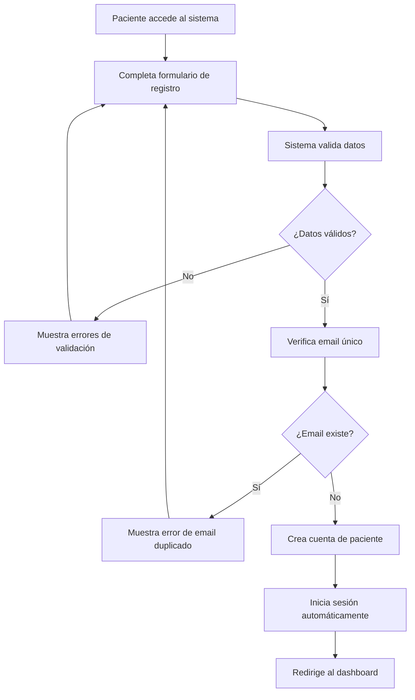
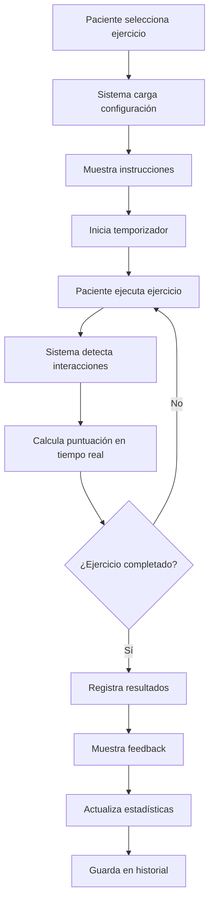
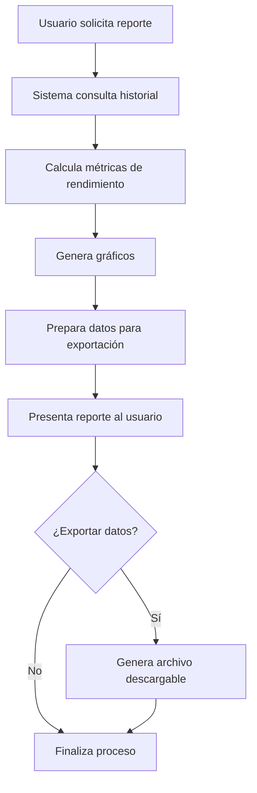

# MODELAMIENTO DEL NEGOCIO - SISTEMA DE REHABILITACIÓN VIRTUAL (RehaVR)

## 1. RESUMEN EJECUTIVO

### 1.1 Descripción del Proyecto

**RehaVR** es un sistema de rehabilitación motora virtual que combina tecnologías web modernas con ejercicios terapéuticos interactivos. El sistema está diseñado para apoyar la rehabilitación de pacientes con discapacidades motoras a través de ejercicios gamificados y terapia ocupacional virtual.

### 1.2 Propósito del Modelamiento

Este documento presenta el modelamiento del negocio para el proyecto de Tesis II, estableciendo la base conceptual, funcional y técnica del sistema de rehabilitación virtual, siguiendo metodologías académicas estándar.

### 1.3 Alcance del Sistema

- **Usuarios Objetivo**: Pacientes con discapacidades motoras, terapeutas ocupacionales, profesionales de la salud
- **Funcionalidades Principales**: Ejercicios de rehabilitación, terapia ocupacional, seguimiento de progreso
- **Tecnologías**: Flask (Backend), React (Frontend), MySQL (Base de datos), Pygame (Ejercicios)

---

## 2. ANÁLISIS DEL DOMINIO DEL NEGOCIO

### 2.1 Contexto del Negocio

#### 2.1.1 Problema Identificado

- **Problema Principal**: Limitaciones en el acceso a terapias de rehabilitación motora personalizadas y monitoreadas
- **Necesidades del Mercado**:
  - Sistemas de rehabilitación accesibles desde casa
  - Monitoreo continuo del progreso del paciente
  - Ejercicios adaptativos según el nivel de discapacidad
  - Reducción de costos en terapias presenciales

#### 2.1.2 Oportunidad de Negocio

- **Mercado Objetivo**: Pacientes con discapacidades motoras temporales o permanentes
- **Valor Propuesto**: Sistema de rehabilitación virtual accesible, personalizable y efectivo
- **Ventaja Competitiva**: Combinación de gamificación, terapia ocupacional y seguimiento automatizado

### 2.2 Stakeholders del Sistema

#### 2.2.1 Actores Primarios

- **Pacientes**: Usuarios finales que realizan ejercicios de rehabilitación
- **Terapeutas**: Profesionales que supervisan y evalúan el progreso
- **Administradores del Sistema**: Personal técnico que mantiene la plataforma

#### 2.2.2 Actores Secundarios

- **Familiares**: Apoyo emocional y supervisión del paciente
- **Instituciones de Salud**: Clínicas, hospitales, centros de rehabilitación
- **Desarrolladores**: Equipo técnico de mantenimiento y mejoras

---

## 3. MODELO DE NEGOCIO

### 3.1 Propuesta de Valor

#### 3.1.1 Para Pacientes

- **Accesibilidad**: Ejercicios disponibles 24/7 desde cualquier dispositivo
- **Personalización**: Niveles de dificultad adaptativos
- **Gamificación**: Interfaz atractiva que motiva la continuidad
- **Seguimiento**: Visualización clara del progreso y mejoras

#### 3.1.2 Para Terapeutas

- **Monitoreo Remoto**: Seguimiento del progreso sin presencia física
- **Datos Objetivos**: Métricas cuantificables de rendimiento
- **Eficiencia**: Reducción de tiempo en evaluaciones manuales
- **Historial Completo**: Registro detallado de todas las sesiones

### 3.2 Modelo de Ingresos

- **Suscripción Mensual**: Acceso completo a ejercicios y seguimiento
- **Licencias Institucionales**: Para clínicas y centros de rehabilitación
- **Servicios Premium**: Análisis avanzados y reportes personalizados

### 3.3 Canales de Distribución

- **Plataforma Web**: Acceso directo desde navegadores
- **Aplicación Móvil**: Versión optimizada para dispositivos móviles
- **Integración Institucional**: APIs para sistemas hospitalarios

---

## 4. ANÁLISIS FUNCIONAL

### 4.1 Casos de Uso Principales

#### 4.1.1 Gestión de Pacientes

```
Actor: Paciente
Descripción: Registro e inicio de sesión en el sistema
Precondiciones: Acceso a internet y dispositivo compatible
Flujo Principal:
1. Paciente accede a la plataforma
2. Selecciona "Registro" o "Inicio de Sesión"
3. Completa formulario con datos personales
4. Sistema valida información
5. Paciente accede al dashboard personalizado
```

#### 4.1.2 Ejercicios de Rehabilitación

```
Actor: Paciente
Descripción: Realización de ejercicios de rehabilitación motora
Precondiciones: Paciente autenticado en el sistema
Flujo Principal:
1. Paciente selecciona nivel de ejercicio (1, 2, o 3)
2. Sistema presenta instrucciones del ejercicio
3. Paciente ejecuta ejercicio usando controles
4. Sistema registra resultados y tiempo
5. Se muestra feedback inmediato
6. Resultados se guardan en historial
```

#### 4.1.3 Terapia Ocupacional

```
Actor: Paciente
Descripción: Realización de actividades de terapia ocupacional
Precondiciones: Paciente autenticado
Flujo Principal:
1. Paciente accede a módulo de terapia ocupacional
2. Selecciona actividad (abotonar camisa, arrastrar objetos)
3. Ejecuta actividad siguiendo instrucciones
4. Sistema evalúa precisión y tiempo
5. Registra resultados en historial
```

#### 4.1.4 Seguimiento de Progreso

```
Actor: Paciente/Terapeuta
Descripción: Visualización del progreso y estadísticas
Precondiciones: Historial de ejercicios disponible
Flujo Principal:
1. Usuario accede a sección de estadísticas
2. Sistema calcula métricas de rendimiento
3. Presenta gráficos y reportes
4. Permite exportar datos
```

### 4.2 Requisitos Funcionales

#### 4.2.1 Autenticación y Autorización

- **RF-001**: El sistema debe permitir registro de nuevos pacientes
- **RF-002**: El sistema debe validar credenciales de inicio de sesión
- **RF-003**: El sistema debe mantener sesiones activas
- **RF-004**: El sistema debe permitir cierre de sesión seguro

#### 4.2.2 Gestión de Ejercicios

- **RF-005**: El sistema debe ofrecer 3 niveles de dificultad
- **RF-006**: El sistema debe registrar resultados de ejercicios
- **RF-007**: El sistema debe calcular puntuaciones automáticamente
- **RF-008**: El sistema debe adaptar dificultad según rendimiento

#### 4.2.3 Terapia Ocupacional

- **RF-009**: El sistema debe incluir ejercicios de motricidad fina
- **RF-010**: El sistema debe simular actividades de la vida diaria
- **RF-011**: El sistema debe evaluar precisión de movimientos
- **RF-012**: El sistema debe registrar tiempo de ejecución

#### 4.2.4 Reportes y Análisis

- **RF-013**: El sistema debe generar estadísticas de progreso
- **RF-014**: El sistema debe mostrar gráficos de rendimiento
- **RF-015**: El sistema debe permitir exportar historial
- **RF-016**: El sistema debe enviar notificaciones de progreso

### 4.3 Requisitos No Funcionales

#### 4.3.1 Rendimiento

- **RNF-001**: Tiempo de respuesta < 2 segundos para operaciones básicas
- **RNF-002**: Soporte para 100 usuarios concurrentes
- **RNF-003**: Disponibilidad del 99.5%

#### 4.3.2 Usabilidad

- **RNF-004**: Interfaz intuitiva para usuarios no técnicos
- **RNF-005**: Compatibilidad con dispositivos móviles
- **RNF-006**: Accesibilidad para usuarios con discapacidades

#### 4.3.3 Seguridad

- **RNF-007**: Encriptación de datos sensibles
- **RNF-008**: Validación de entrada de datos
- **RNF-009**: Backup automático de información

---

## 5. ARQUITECTURA DEL SISTEMA

### 5.1 Arquitectura General

```
┌─────────────────┐    ┌─────────────────┐    ┌─────────────────┐
│   Frontend      │    │    Backend      │    │   Base de       │
│   (React)       │◄──►│   (Flask)       │◄──►│   Datos         │
│                 │    │                 │    │   (MySQL)       │
└─────────────────┘    └─────────────────┘    └─────────────────┘
```

### 5.2 Componentes del Sistema

#### 5.2.1 Capa de Presentación (Frontend)

- **Tecnología**: React 18 + Vite
- **Responsabilidades**:
  - Interfaz de usuario
  - Interacción con ejercicios
  - Visualización de datos
  - Gestión de estado local

#### 5.2.2 Capa de Lógica de Negocio (Backend)

- **Tecnología**: Flask + Python
- **Patrones Implementados**:
  - MVC (Model-View-Controller)
  - Repository Pattern
  - Service Layer Pattern
  - Factory Pattern

#### 5.2.3 Capa de Datos

- **Tecnología**: MySQL
- **Responsabilidades**:
  - Persistencia de datos de pacientes
  - Almacenamiento de historial de ejercicios
  - Gestión de sesiones de terapia

### 5.3 Flujo de Datos

#### 5.3.1 Autenticación

```
Frontend → AuthController → PacienteService → PacienteRepository → MySQL
```

#### 5.3.2 Ejercicios

```
Frontend → EjercicioController → EjercicioService → EjercicioRepository → MySQL
```

#### 5.3.3 Reportes

```
Frontend → ReportController → ReportService → DataRepository → MySQL
```

---

## 6. MODELO DE DATOS

### 6.1 Entidades Principales

#### 6.1.1 Paciente

```sql
CREATE TABLE pacientes (
    id INT PRIMARY KEY AUTO_INCREMENT,
    nombre VARCHAR(100) NOT NULL,
    email VARCHAR(100) UNIQUE NOT NULL,
    password VARCHAR(255) NOT NULL,
    edad INT NOT NULL,
    fecha_registro TIMESTAMP DEFAULT CURRENT_TIMESTAMP,
    notas TEXT,
    activo BOOLEAN DEFAULT TRUE
);
```

#### 6.1.2 Ejercicio

```sql
CREATE TABLE ejercicios (
    id INT PRIMARY KEY AUTO_INCREMENT,
    nombre VARCHAR(100) NOT NULL,
    descripcion TEXT,
    tipo ENUM('rehabilitacion', 'terapia_ocupacional') NOT NULL,
    nivel INT NOT NULL,
    parametros JSON,
    activo BOOLEAN DEFAULT TRUE
);
```

#### 6.1.3 Historial de Ejercicios

```sql
CREATE TABLE historial_ejercicios (
    id INT PRIMARY KEY AUTO_INCREMENT,
    paciente_id INT NOT NULL,
    ejercicio_id INT NOT NULL,
    fecha TIMESTAMP DEFAULT CURRENT_TIMESTAMP,
    exito BOOLEAN NOT NULL,
    duracion_segundos INT,
    puntuacion INT,
    observaciones TEXT,
    FOREIGN KEY (paciente_id) REFERENCES pacientes(id),
    FOREIGN KEY (ejercicio_id) REFERENCES ejercicios(id)
);
```

#### 6.1.4 Sesiones de Terapia

```sql
CREATE TABLE sesiones_terapia (
    id INT PRIMARY KEY AUTO_INCREMENT,
    paciente_id INT NOT NULL,
    fecha TIMESTAMP DEFAULT CURRENT_TIMESTAMP,
    duracion_minutos INT NOT NULL,
    tipo_terapia VARCHAR(100),
    observaciones TEXT,
    FOREIGN KEY (paciente_id) REFERENCES pacientes(id)
);
```

### 6.2 Relaciones entre Entidades

```
Paciente (1) ──── (N) HistorialEjercicios
Paciente (1) ──── (N) SesionesTerapia
Ejercicio (1) ──── (N) HistorialEjercicios
```

---

## 7. PROCESOS DE NEGOCIO

### 7.1 Proceso de Registro de Paciente



### 7.2 Proceso de Ejecución de Ejercicio



### 7.3 Proceso de Generación de Reportes



---

## 8. MÉTRICAS Y KPIs

### 8.1 Métricas de Usuario

- **Usuarios Activos Mensuales (MAU)**
- **Tiempo Promedio de Sesión**
- **Frecuencia de Uso por Usuario**
- **Tasa de Retención de Usuarios**

### 8.2 Métricas de Ejercicios

- **Ejercicios Completados por Día**
- **Tasa de Éxito por Nivel**
- **Tiempo Promedio de Completación**
- **Progreso Promedio por Usuario**

### 8.3 Métricas de Negocio

- **Costo de Adquisición de Usuario (CAC)**
- **Valor de Vida del Usuario (LTV)**
- **Tasa de Conversión de Registro**
- **Satisfacción del Usuario (NPS)**

---

## 9. RIESGOS Y MITIGACIONES

### 9.1 Riesgos Técnicos

- **Riesgo**: Fallos en la base de datos
- **Mitigación**: Backup automático y replicación de datos
- **Riesgo**: Problemas de rendimiento con múltiples usuarios
- **Mitigación**: Implementación de caché y optimización de consultas

### 9.2 Riesgos de Negocio

- **Riesgo**: Baja adopción por parte de usuarios
- **Mitigación**: Programa de pruebas piloto y feedback continuo
- **Riesgo**: Competencia de soluciones similares
- **Mitigación**: Diferenciación a través de gamificación y personalización

### 9.3 Riesgos de Seguridad

- **Riesgo**: Violación de datos de pacientes
- **Mitigación**: Encriptación y cumplimiento de normativas de salud

---

## 10. PLAN DE IMPLEMENTACIÓN

### 10.1 Fases del Proyecto

#### Fase 1: Desarrollo del Core (Semanas 1-4)

- Implementación de autenticación
- Desarrollo de ejercicios básicos
- Configuración de base de datos

#### Fase 2: Funcionalidades Avanzadas (Semanas 5-8)

- Terapia ocupacional
- Sistema de reportes
- Optimización de rendimiento

#### Fase 3: Pruebas y Refinamiento (Semanas 9-12)

- Pruebas de usuario
- Corrección de errores
- Optimización de UX

### 10.2 Criterios de Aceptación

- Sistema funcional con todas las características principales
- Pruebas de carga exitosas
- Documentación completa
- Código revisado y optimizado

---

## 11. CONCLUSIONES

### 11.1 Viabilidad del Proyecto

El sistema RehaVR presenta una solución viable para la rehabilitación motora virtual, con una arquitectura sólida y funcionalidades bien definidas que abordan las necesidades identificadas en el mercado.

### 11.2 Impacto Esperado

- **Para Pacientes**: Mejora en la accesibilidad y motivación para la rehabilitación
- **Para Terapeutas**: Herramientas eficientes para el monitoreo remoto
- **Para el Sector Salud**: Reducción de costos y mejora en la calidad del servicio

### 11.3 Próximos Pasos

1. Implementación del sistema según el plan definido
2. Pruebas piloto con usuarios reales
3. Iteración basada en feedback
4. Escalamiento y comercialización

---

## 12. REFERENCIAS

- Fowler, M. (2002). Patterns of Enterprise Application Architecture
- Gamma, E. et al. (1994). Design Patterns: Elements of Reusable Object-Oriented Software
- Sommerville, I. (2016). Software Engineering
- Normativas de Salud Digital y Protección de Datos Personales

---

**Documento elaborado para el proyecto de Tesis II - Sistema de Rehabilitación Virtual (RehaVR)**

_Fecha de elaboración: Diciembre 2024_
_Versión: 1.0_
